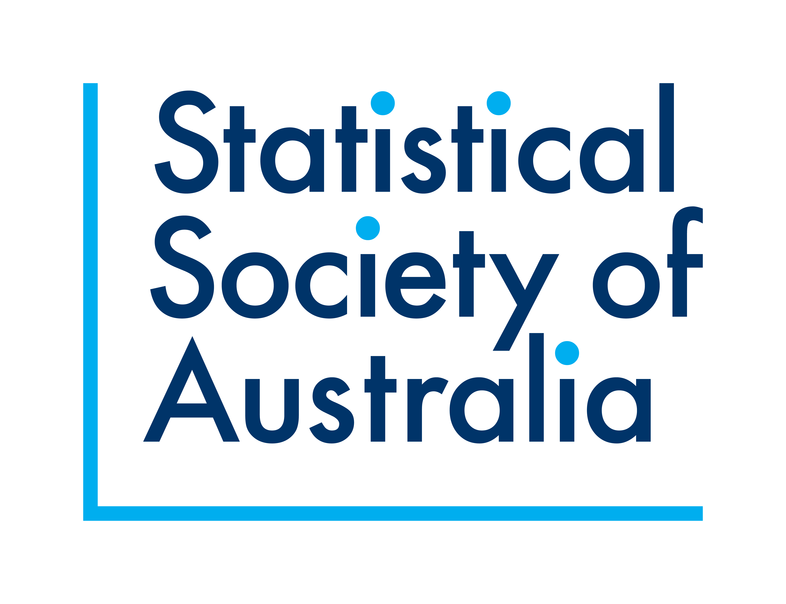

The Di Cook award was established in 2021 by the Statistical Society of Australia, Victorian Branch. This award was created to recognise outstanding open-source statistical software and student developers in the state of Victoria, Australia.

In this website, you can find a myriad of high-quality entries currently in the competition. 
